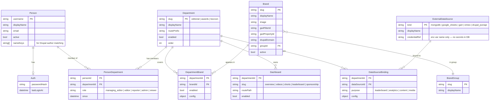
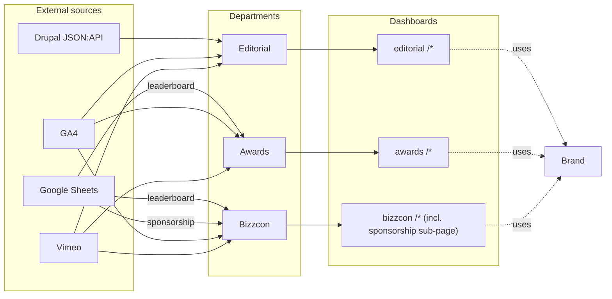

# Architecture — Entity Model

> **Purpose.** This is the design for a **brand-new repo** that replaces (or coexists with) the current `ga4-dashboard` project. Same stack — Next.js + MongoDB — but a **fresh database** and a **clean entity model from day one**. The existing repo stays untouched and serves as a reference for code patterns to lift.
>
> Long-term intent (replace old vs. coexist) is not yet decided; the plan keeps the door open to either.
>
> Read this, mark anything wrong or missing, answer the open questions, and we'll spin up the new repo.

---

## 1. Entity graph

**Why this shape.** In the existing project, these relationships are *implicit*: department lives only in route folder names, person↔brand exists only as a name-string match, and per-vertical brand opt-in lives as three boolean columns on a single doc. Naming these as first-class entities from day one is what prevents the same drift in the new project.

---

## 2. Departments

Three verticals act as departments. Promote them.

| Slug | Display name | Route prefix | Today's brand-flag | Primary data sources |
|---|---|---|---|---|
| `editorial` | Editorial | `/dashboard/editorial` | `editorial: true` | Drupal JSON:API, GA4, Vimeo |
| `awards` | Awards | `/dashboard/awards` | `awards: true` | Google Sheets, GA4, Vimeo |
| `bizzcon` | Bizzcon (Events) | `/dashboard/bizzcon` | `events: true` | Google Sheets, GA4, Vimeo |

**Sponsorship is a Bizzcon sub-feature, not a department.** It surfaces as a `Dashboard` row under the `bizzcon` department (`slug: sponsorship`, route `/dashboard/bizzcon/sponsorship`) and pulls from its own Google Sheets binding (`purpose: sponsorship`). It does not get its own `Department` row, its own people, or its own brand flag.

Each Department gets a `Dashboard` row per sub-page (`overview`, `videos`, `shorts`, `leaderboard`, plus `sponsorship` for Bizzcon) so adding a new sub-page is data, not a schema change.

---

## 3. People

Today's two parallel systems collapse into one.

| Today | Tomorrow |
|---|---|
| `admin-users` collection — `{ username, passwordHash }`, no roles, no department | `Person` row with `auth: { passwordHash }`, joined to one or more `PersonDepartment` rows |
| `dashboard-config/editorial-roster` doc — `{ name, role, username }`, free-text role | Same `Person` row (auth is optional), `PersonDepartment.role` from a fixed enum |
| Author matching — `normalizeKey(name)` against roster usernames at request time | `Person.nameKeys[]` pre-computed at write time, indexed |

UI label: the admin page formerly known as "Roster" is **Editorial team** — never "Roster" in any user-facing string.

Roles (initial enum, expandable per department later):
- `managing_editor`
- `editor`
- `reporter`
- `admin` (login-capable, currently global)
- `viewer` (display-only, no login)

A Person can hold different roles in different departments via separate `PersonDepartment` rows.

---

## 4. Data flow

The `DataSourceBinding` table is what turns the dotted lines above into queryable config — instead of `lib/leaderboardSources.ts` reading env vars by hard-coded keys, it asks "what is the Sheets binding for the Awards department's leaderboard purpose?".

---

## 5. Collections in the new database

The new MongoDB database starts clean with named collections — no `dashboard-config` kitchen sink.

| Collection | Purpose | Source for initial seed (from existing project) |
|---|---|---|
| `people` | Person + optional `auth` subdocument | `admin-users` collection + `dashboard-config/editorial-roster` doc |
| `person_departments` | Membership + role | (new — derived from roster `role` strings) |
| `departments` | Vertical registry | (new — one row per existing route folder) |
| `brands` | Canonical brand list | `data/brand_properties.json` + `dashboard-config/brand-all-properties` |
| `brand_groups` | Group registry | `data/groups.json` |
| `department_brands` | Per-vertical brand opt-in | `editorial`/`awards`/`events` booleans |
| `dashboards` | Dashboard route registry | (new — one row per existing sub-page) |
| `external_data_sources` | Source registry | (new — derived from env vars in `.env.example`) |
| `data_source_bindings` | Department→Source wiring | (new — derived from `lib/leaderboardSources.ts`) |
| `admin_references` | Admin link list | `dashboard-config/admin-references` doc |
| `saved_references` | Google Sheets references | `dashboard-config/saved-references` doc |

A one-time **import script** (run only when the user decides to populate the new DB with real data) reads from the existing project's MongoDB + JSON files and writes into the new DB in the new shape. Until then, the new DB is empty or holds dev fixtures.

---

## 6. Build phases (new repo)

The new project is greenfield — no migration, no dual-write, no cutover. Phases describe how to build it up cleanly. Each phase produces a runnable app on `dev`; promotion to `main` only after user verification.

- [ ] **Phase 0 — Visualize** *(this document)*. Sign off on the entity model and answer open questions before any repo is created.
- [ ] **Phase 1 — Scaffold the new repo.** Fresh git repo. Next.js 15 + TypeScript + MongoDB driver + Tailwind (matching the existing stack). Empty homepage, healthcheck route, `.env.example`. Wire CI for typecheck + build.
- [ ] **Phase 2 — Entity layer.** `lib/entities/` types and `lib/repos/*` matching §1. MongoDB indexes defined per collection. Repo unit tests against an ephemeral Mongo (Testcontainers or `mongodb-memory-server`).
- [ ] **Phase 3 — Admin shell.** Auth (lift the bcrypt + cookie-session pattern from the existing `lib/adminAuth.ts`/`lib/adminSession.ts`). CRUD pages for Departments, Brands, BrandGroups, People, DepartmentBrands. The "Editorial team" page replaces the old "Roster" UI label.
- [ ] **Phase 4 — Data source integrations.** Lift and adapt: GA4 client, Google OAuth/Sheets, Vimeo helpers, Drupal JSON:API patterns. Each integration is wired through `data_source_bindings` rather than hard-coded env keys.
- [ ] **Phase 5 — Dashboards.** Build the three department dashboards (`editorial`, `awards`, `bizzcon`). Sub-page set (`overview`, `videos`, `shorts`, `leaderboard`, plus `sponsorship` under Bizzcon) is data-driven from the `dashboards` collection.
- [ ] **Phase 6 — Optional data import.** One-time script to read the existing project's MongoDB + JSON files and seed the new DB. Run only when the user decides to populate with real data. Idempotent so it can be re-run.
- [ ] **Phase 7 — Cutover decision.** At this point the new app has parity. The user decides: redirect traffic to the new project, run both, or keep the new one as a rebuild reference. Plan does not assume which.

### What to lift from the existing repo

Identified as worth copying into the new project (not rewriting):

| From | Why it's worth lifting |
|---|---|
| `lib/db/adapter.ts`, `lib/db/mongodb.ts` | MongoDB connection + adapter pattern |
| `normalizeKey()` in `lib/editorialAccounts.ts` | Author name normalization for Drupal joins |
| `lib/googleOAuth.ts` | Google OAuth refresh-token flow |
| `lib/vimeo.ts` | Vimeo API helper |
| `lib/leaderboardSources.ts` | Google Sheets leaderboard fetch (refactor to use `data_source_bindings`) |
| `scripts/seed-admin-user.mjs` (pattern) | Bcrypt seeding pattern for first admin user |
| `data/brand_properties.json`, `data/brand_ga4_properties.json`, `data/groups.json` | Source of truth for the initial brand seed |
| GA4 client setup from `src/app/test-sbr/page.tsx` | Reusable `BetaAnalyticsDataClient` config |
| `.env` variable list | MONGODB_URI, GOOGLE_OAUTH_*, VIMEO_ACCESS_TOKEN, ADMIN_SESSION_SECRET — pattern carries over |

What to leave behind:
- The `dashboard-config` kitchen-sink doc shape
- The `/api/json-provider/[collection]/[document]` generic-Mongo proxy
- The free-text role strings on the editorial roster
- The hard-coded Drupal domain list in `src/app/test-sbr/page.tsx`
- The `/test-sbr` route (already flagged for deletion in the old repo)

---

## 7. Open questions

These do not block Phase 0. They block Phase 2 (the entity layer) or Phase 6 (the data import).

1. **New repo name and location.** Suggested: `ga4-dashboard-v2` or a different name (e.g. `cmg-dashboard`)? Path on disk?
2. **Sponsorship sub-page.** Sponsorship is a Bizzcon sub-page in the new model. Build it from the start in Phase 5, or seed the `Dashboard` row as `enabled: false` and build later? Also: should the existing `src/app/api/sponsorship/route.ts` shape carry over verbatim, or is the data shape getting reworked too?
3. **Role taxonomy.** Is the editorial enum (`managing_editor`, `editor`, `reporter`, plus `admin` and `viewer`) sufficient for awards / bizzcon teams too, or do they need their own role vocabularies?
4. **Multi-department people.** Can one Person belong to Editorial *and* Awards (or Bizzcon) with different roles? The model supports it via separate `person_departments` rows; confirm.
5. **Auth scope.** `role: admin` global (as today) or department-scoped in the new project?
6. **Username collisions (only matters at Phase 6).** When the import runs, if an `admin-users` username matches an `editorial-roster` username, treat them as the same Person automatically, or flag for manual review?
7. **GA4 property mapping.** Inline `brands.ga4PropertyId` (in DB) or keep a separate JSON file checked into the repo?
8. **Hosting.** Will the new project deploy to the same host as the existing one (Vercel? self-hosted?), or a different one? Affects how env vars are managed.

---

## 8. What this document is *not*

- Not a code plan. The phase checklist names what's in each phase, but actual diffs come once the new repo exists.
- Not a UI spec. The "Editorial team" label rule applies, but specific layouts are out of scope.
- Not a permissions design. Auth scope (open question 5) is intentionally deferred until the model is signed off.
- Not a migration plan for the existing project. The existing `ga4-dashboard` repo stays untouched; this document describes what gets built in a new repo alongside it.

---

## 9. Where this document lives

This file is currently in the **existing** repo (`C:\Web\ga4-dashboard\docs\architecture.md`) so it's easy to reference alongside the code it describes. When the new repo is created in Phase 1, copy this file into it as `docs/architecture.md` and treat the new repo's copy as the source of truth going forward.
